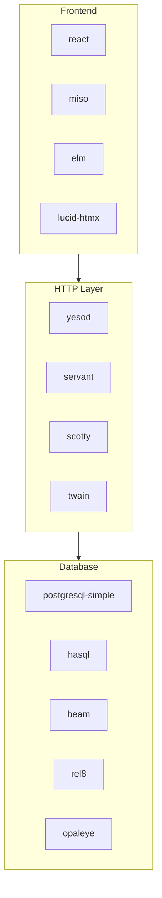
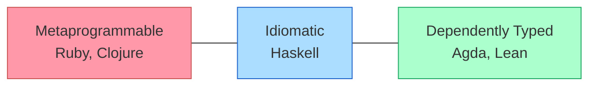
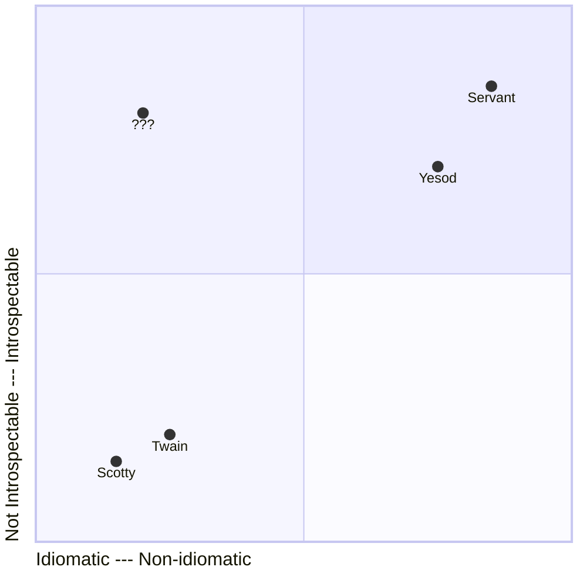
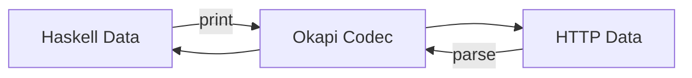

# One Truth; Many Perspectives

## Motivation

My goal over the past few years has been to help simplify backend web development in Haskell. After working on many web applications using Haskell in various ways, I came to the conclusion that one of the biggest gaps in the web ecosystem is the HTTP/routing layer.



The strongest solutions depend on type-level programming or metaprogramming to provide the features expected of a modern web framework, i.e. type-safe URLs and free OpenAPI documentation. In either case, these language features are not idiomatic Haskell. Haskell is not Clojure or Ruby, and it isn't Agda or Lean.



The weaker solutions use more idiomatic abstractions for their interface, like monads, but they lack type-safety and the ability to statically analyze the structure of the API. You don't get any of the amenities that you would like to have for a larger, more serious project, but these frameworks are easier to use and get started quickly with.



I spent a lot of time experimenting with different combinations of language features to see if there exists an idiomatic subset of Haskell that would allow me to build APIs with the type-safety and introspectibility of servant, but with a term-level DSL like scotty's. Here's what I found:

```haskell
-- Request
getUserReq
  = Req.get
  & Req.path do -- /users/{userId:Text}
      Path.lit @Text "users"
      userId <- Path.seg @Text "userId"
      pure userId
  & Req.query do
		  Query.param' @Text "filter"

-- Responses
data GetUserRes f
  = OkRes        (Res f S200 (Text, Text) LBS.ByteString)
  | NotFoundRes  (Res f S404 Int LBS.ByteString)
  | ErrorRes     (Res f S500 HTTP.ResponseHeaders LBS.ByteString)
  deriving (Generic, GenericResAlt)

okResponse
  = Res.ok
  & Res.headers do
      ct  <- fst =. Res.header "content-type"
      loc <- snd =. Res.header "location"
      pure (ct, loc)

notFoundResponse
  = Res.notFound
  & Res.headers (Res.header @Int "retry-after")

getUserResponses = resCase @GetUserRes
  notFoundResponse
  okResponse
  Res.serverError

-- Endpoint
getUserEndpoint = getUserReq :-> getUserResponses
```

The above code snippet defines a single API endpoint. From this single piece of declarative code we can implement a type-safe handler, derive a type-safe client in any language we want, generate an OpenAPI specification, and much more.

## Codecs

The foundation of Okapi is codecs. A codec is a parser and a printer.



I got this idea from [Li-yao Xia](https://blog.poisson.chat/posts/2017-01-01-monadic-profunctors.html) and Haskell packages like [autodocodec](https://hackage.haskell.org/package/autodocodec).

Okapi provides primitive codecs for describing HTTP requests and responses. The most basic request and response codecs are `Req.req` and `Res.res`. These codecs represent the most general HTTP request, and the most general HTTP response.

```haskell
aRequest = Req.any

aResponse = Res.any
```

### Request

Codecs that describe anything provide no information. We can add constraints, and therefore information, to these *base codecs* by piping them through combinators using the `(&)` operator. For example, suppose I want a request codec that only matches/produces requests that have the DELETE method and the path `/account/{accountId}` where `accountId` is an `Int`.

```haskell
aRequest
  = Req.any
  & Req.method DELETE
  & Req.path do -- Requires BlockArguments language extension
      Path.lit @Text "account"
      acctId <- Path.seg @Int "accountId"
      pure acctId
```

The `Req.method` combinator is used to specify the method, and the `Req.path` combinator along with an `ApplicativeDo` block to specify the path. There are also combinators for constraining the query, headers, and body of a request.

```haskell
myReq
  = Req.any
  & Req.method GET
  & Req.path do
      Path.lit @Text "users"
      userId <- Path.seg @Text "userId"
      pure userId
  & Req.query (Query.param' @Text "filter")
  & Req.headers (Req.header' @Text "x-header")
  & Req.json @Value
```

Okapi provides base codecs where the request method is fixed, so you don't have to start with `Req.req` and then modify it with a method tag. You can just start with the method.

```haskell
myReq
  = Req.get
  & Req.path do
      Path.lit @Text "users"
      userId <- Path.seg @Int "userId"
      pure userId
  & Req.query (Query.param' @Text "filter")
  & Req.headers (Req.header' @Text "x-header")
  & Req.json @Value
```

The order in which you pipe your codec through combinators does not matter; for example, the following rewrite is equivalent to the original above.

```haskell
myReq
  = Req.get
  & Req.headers (Req.header' @Text "x-header")
  & Req.query (Query.param' @Text "filter")
  & Req.json @Value
  & Req.path do
      Path.lit @Text "users"
      userId <- Path.seg @Text "userId"
      pure userId
```

While the order in which you apply combinators doesn't matter, the number of times you apply a combinator does matter. The types prevent users from applying the same combinator to a codec more than once.

```haskell
myReq
  = Req.get
  & Req.headers (Req.headerOpt @Text "x-header")
  & Req.query (Req.paramOpt @Text "filter")
  & Req.json @Value
  & Req.method PUT -- Compile-time error. Method already fixed by `Req.get`
  & Req.path do
      _      <- Path.lit @Text "users"
      userId <- Path.seg @Text "userId"
      pure userId
```

### Response

Response codecs are just like request codecs, but instead of a `method` you have a `status`, and you don't have `query` or `path` combinators of course.

```haskell
myRes
  = Res.ok
  & Res.headers do
      ct  <- fst =. Res.header "content-type"
      loc <- snd =. Res.header "location"
      pure (ct, loc)
  & Res.json @Value
```

In Okapi, the description of the response is just as important as the description of the request.

### Choosing Responses

We use **sum types** to properly model the fact that an endpoint returns 1 of many possible responses, just like you would with a normal function. If there's actually only 1 possible response, we wrap the response codec with `only`.

```haskell
aResponse = ...

onlyResponse = only aResponse
```

To represent multiple possible responses, the user must:
1. Define a sum type where each constructor takes only 1 argument, and that argument is of the `Res` type
2. Generically derive a `GenericResAlt` instance for the sum type
3. Use the `resCase` function to safely produce a codec for the sum type by passing in a response codec for each constructor

Instead of introducing the `(<|>)` combinator from the `Alternative` typeclass into our response description language, we use *datatype generic programming* to generate code that automatically wraps/unwraps the outputs/inputs of our codecs with the correct constructor. This technique is inspired by the [generic-case](https://hackage-content.haskell.org/package/generic-case-0.1.1.1/docs/Generics-Case.html) package.

```haskell
data GetUserRes f
  = OkRes       (Res f S200 (Text, Text) LBS.ByteString)
  | NotFoundRes (Res f S404 Int LBS.ByteString)
  | ErrorRes    (Res f S500 HTTP.ResponseHeaders LBS.ByteString)
  deriving (Generic, GenericResAlt)

okResponse
  = Res.ok
  & Res.headers do
      ct  <- fst =. Res.header "content-type"
      loc <- snd =. Res.header "location"
      pure (ct, loc)

notFoundResponse
  = Res.notFound
  & Res.headers (Res.header @Int "retry-after")

getUserResponses = resCase @GetUserRes
  okResponse
  notFoundResponse
  Res.serverError
```

If your sum type isn't a valid shape, the compiler will reject it. Notice the response codecs for each constructor are passed to `resCase` in the same order they are defined in the data declaration.

## Endpoint

An association between the description of a request and the description of a response is the description of an **endpoint**.

```haskell
aRequest = ...

aResponse = ...

anEndpoint = aRequest :-> only aResponse
```

It looks like a lambda expression. It describes what the endpoint consumes, and what it produces in terms of HTTP.

### The Two Perspectives

If we can parse and print the input to an endpoint, and parse and print the outputs of the endpoint, we can use the endpoint to implement an HTTP server or client.

|        | Request | Response |
|--------|---------|----------|
| Server | Parses  | Prints   |
| Client | Prints  | Parses   |

These are the 2 perspectives of an endpoint.

### Grouping Endpoints

Endpoints can be grouped to form an API. Because each endpoint is a first-class value, grouping them is as simple as collecting values in a list or any other data structure. There's no special routing table syntax — just Haskell.

```haskell
myApi =
  [ getUserEndpoint
  , createUserEndpoint
  , deleteUserEndpoint
  ]
```

## Conclusion

Okapi demonstrates that type-safe, introspectable HTTP APIs in Haskell don't require type-level programming or Template Haskell. By building on codecs — values that are both parsers and printers — we get a term-level DSL that's composable, analyzable at runtime, and readable by anyone familiar with standard Haskell abstractions.
