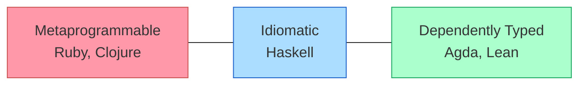
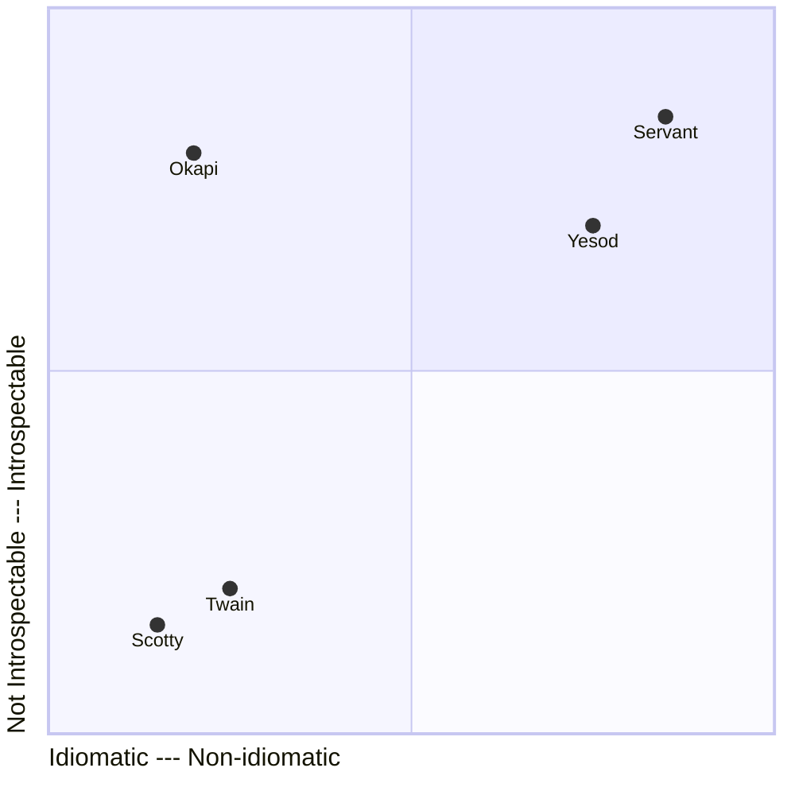
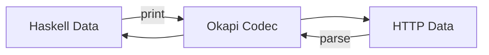

# Invertible HTTP Descriptions with Okapi

## Motivation

After working on various web backends written in Haskell over the past few years, I realized that backend web development in Haskell is not good when compared to other programming languages.

The best solutions we have depend on type-level programming or metaprogramming to provide the features expected of a modern web framework, i.e. type-safe URLs and automatic OpenAPI documentation generation. In either case, these language features are not idiomatic Haskell. Haskell is not Clojure or Ruby, and it isn't Agda or Lean.



The weaker solutions provide more idiomatic abstractions for describing APIs, like monads, but they lack type-safety and aren't statically analyzeable. You aren't provided any of the amenities that you would like to have for a larger, more serious project, but these frameworks have a shallower learning curve making them popular amongst those new to Haskell.



I spent a lot of time experimenting with different combinations of language features to see if there exists an idiomatic subset of Haskell that would allow users to build APIs with the type-safety and introspectibility of `servant`, and the shallow learning curve and ergonomics of `scotty`. I discovered `okapi`:

```haskell
-- Request
getUserReq
  = Req.get
  & Req.path do -- /users/{userId:Text}
      Req.lit @Text "users"
      userId <- Req.seg @Text "userId"
      pure userId
  & Req.query do
      Req.param' @Text "filter"

-- Responses Sum Type
data GetUserRes f
  = OkRes       (Res f S200 (Text, Text) LBS.ByteString)
  | NotFoundRes (Res f S404 Int LBS.ByteString)
  deriving (Generic, GenericResAlt)

-- Ok Response
okResponse
  = Res.s200
  & Res.headers do
      ct  <- fst =. Res.header "content-type"
      loc <- snd =. Res.header "location"
      pure (ct, loc)

-- Not Found Response
notFoundResponse
  = Res.s404
  & Res.headers do
      Res.header @Int "retry-after"

-- Response Choices
getUserResponses = resCase @GetUserRes
  notFoundResponse
  okResponse

-- Endpoint
getUserEndpoint = getUserReq :-> getUserResponses
```

The above code snippet defines a single API endpoint. Using these modular, term-level blocks of declarative code, we can:

- Implement type-safe servers
- Derive type-safe clients in any language
- Generate OpenAPI specifications

and much more. In Okapi, the API description language is just pure data so we can interpret it anyway we want.

## Codecs

At the core of Okapi are codecs. A codec is a parser and a printer.



I got this idea from [Li-yao Xia](https://blog.poisson.chat/posts/2017-01-01-monadic-profunctors.html)'s amazing work, and Haskell packages like [autodocodec](https://hackage.haskell.org/package/autodocodec).

The most basic request and response codecs are `Req.any` and `Res.any`. These codecs represent the most general HTTP request, and the most general HTTP response, respectively.

```haskell
aRequest = Req.any

aResponse = Res.any
```

### Request

Codecs that describe anything provide no information. We can add constraints, and therefore information, to the most general codecs by piping them through combinators using the `(&)` operator. For example, suppose I want a request codec that matches and produces requests that have the `DELETE` method, and the path `/account/{accountId}` where `accountId` is an `Int`.

```haskell
aRequest
  = Req.any
  & Req.method DELETE
  & Req.path do -- Requires BlockArguments language extension
      Req.lit @Text "account"
      acctId <- Req.seg @Int "accountId"
      pure acctId
```

The `Req.method` combinator is used to specify the method, and the `Req.path` combinator along with an `ApplicativeDo` block to specify the path. There are other combinators for constraining the query, headers, and body of a request.

```haskell
myReq
  = Req.any
  & Req.method GET
  & Req.path do
      Req.lit @Text "users"
      userId <- Req.seg @Text "userId"
      pure userId
  & Req.query (Req.param' @Text "filter")
  & Req.headers (Req.header' @Text "x-header")
  & Req.json @Value
```

Okapi provides codec values where the request method is fixed, so you don't have to start with `Req.any` and then modify it with the `method` combinator every time. You can just start with the method itself.

```haskell
myReq
  = Req.get
  & Req.path do
      Req.lit @Text "users"
      userId <- Req.seg @Text "userId"
      pure userId
  & Req.query do
      Req.param' @Text "filter"
  & Req.headers do
      Req.header' @Text "x-header"
  & Req.json @Value
```

The order in which you pipe your codec through combinators does not matter; for example, the following rewrite is equivalent to the original above.

```haskell
myReq
  = Req.get
  & Req.headers do
      Req.header' @Text "x-header"
  & Req.query do
      Req.param' @Text "filter"
  & Req.json @Value
  & Req.path do
      Req.lit @Text "users"
      userId <- Req.seg @Text "userId"
      pure userId
```

While the order in which you apply combinators doesn't matter, the number of times you apply a combinator does matter. The types prevent users from applying the same combinator to a codec more than once.

```haskell
myReq
  = Req.get
  & Req.headers do
      Req.header' @Text "x-header"
  & Req.query do
      Req.param' @Text "filter"
  & Req.json @Value
  & Req.method PUT -- Compile-time error. Method already fixed by `Req.get`
  & Req.path do
      Req.lit @Text "users"
      userId <- Req.seg @Text "userId"
      pure userId
```

### Response

Response codecs are just like request codecs, but instead of a `method` you have a `status`, and you don't have `query` or `path` combinators of course.

```haskell
myRes
  = Res.s200
  & Res.headers do
      ct  <- fst =. Res.header "content-type"
      loc <- snd =. Res.header "location"
      pure (ct, loc)
  & Res.json @Value
```

Unlike most web frameworks, in Okapi, the description of a response is just as important as the description of a request.

### Choosing Responses

Okapi uses **sum types** to properly model the fact that an endpoint can return one of many possible responses. This is revolutionary amongst Haskell web frameworks even though sum types have always modelled this fact of HTTP percisely. Simply:

1. Define a sum type where each constructor takes only one argument, and that argument is of the `Res` type
2. Generically derive a `GenericResAlt` instance for the sum type
3. Use the `resCase` function to safely produce a codec for the sum type by passing in a response codec for each constructor

Instead of introducing the `(<|>)` combinator from the `Alternative` typeclass into our response description language, we use *datatype generic programming* to generate code that automatically wraps/unwraps the outputs/inputs of our codecs with the correct constructors. This technique is inspired by the [generic-case](https://hackage-content.haskell.org/package/generic-case-0.1.1.1/docs/Generics-Case.html) package.

```haskell
data GetUserRes f
  = OkRes       (Res f S200 (Text, Text) LBS.ByteString)
  | NotFoundRes (Res f S404 Int LBS.ByteString)
  | ErrorRes    (Res f S500 HTTP.ResponseHeaders LBS.ByteString)
  deriving (Generic, GenericResAlt)

okResponse
  = Res.s200
  & Res.headers do
      ct  <- fst =. Res.header "content-type"
      loc <- snd =. Res.header "location"
      pure (ct, loc)

notFoundResponse
  = Res.s404
  & Res.headers do
      Res.header @Int "retry-after"

getUserResponses = resCase @GetUserRes
  okResponse
  notFoundResponse
  Res.s500
```

If your sum type isn't a valid shape, the compiler will reject it. Notice the response codecs for each constructor are passed to `resCase` in the same order they are defined in the data type declaration.

If there's only one possible response, we wrap the response codec with `only`.

```haskell
aResponse = ...

onlyResponse = only aResponse
```

## Endpoint

An association between a request codec and a responses codec is an **endpoint**.

```haskell
aRequest = ...

aResponse = ...

anEndpoint = aRequest :-> only aResponse
```

It looks like a lambda expression. It describes what the endpoint consumes, and what it produces in terms of HTTP.

### One Truth; Two Perspectives

If we can parse and print the request of the endpoint, and parse and print the responses of the endpoint, we can use the endpoint to implement an HTTP server or client.

|        | Request | Response |
|--------|---------|----------|
| Server | Parses  | Prints   |
| Client | Prints  | Parses   |

The two perspectives of an endpoint are derived from a single source of truth.

### Combining Endpoints

`okapi` uses higher-kinded records types to combine endpoints. 

## Terms Over Types

You may have noticed that the examples shown have no type annotations. This is because they aren't necessary at all. GHC can perfectly infer the types of your contracts from the terms used and type applications. If the user wants to know the type of an `okapi` expression, they can use `GHCi` and the `:t <expr>` command.

## Conclusion
